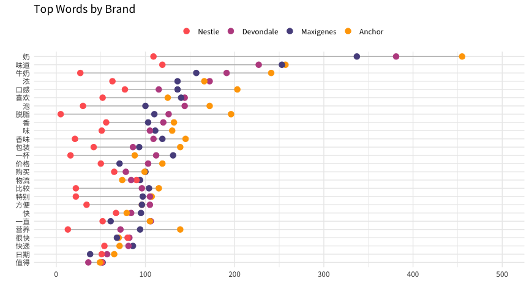
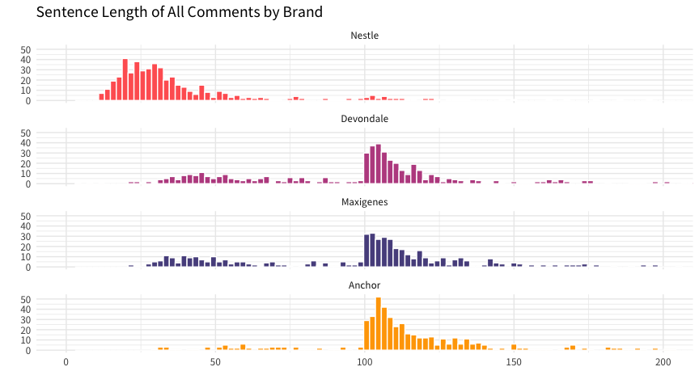
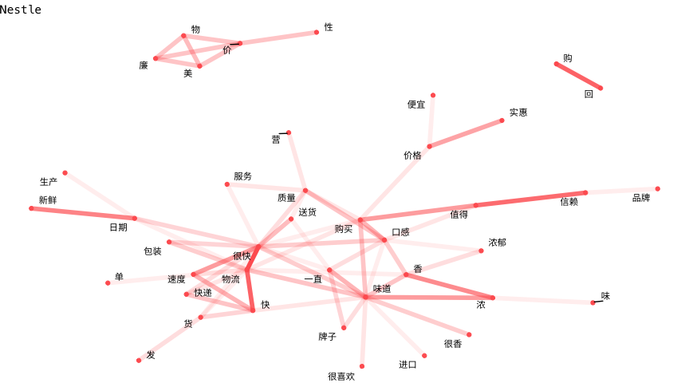
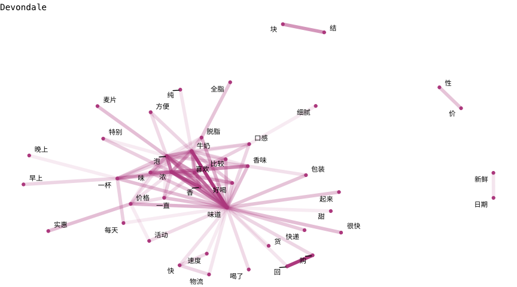
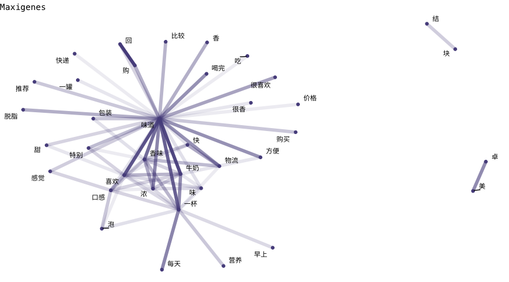
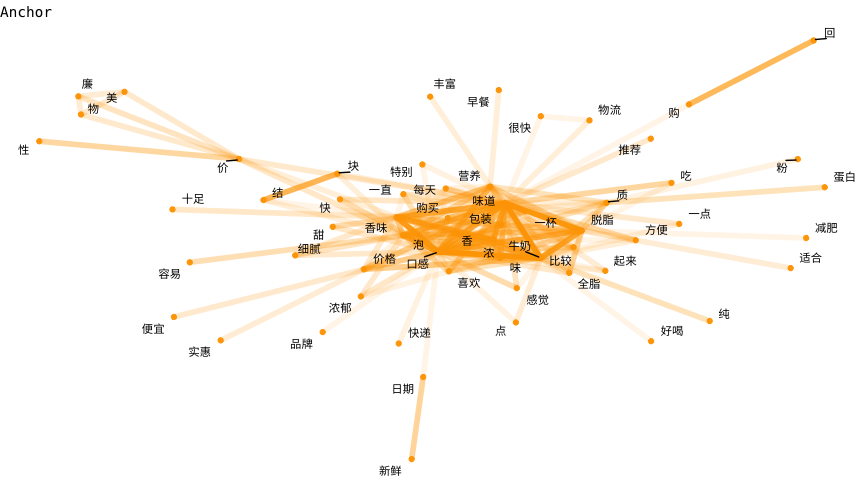
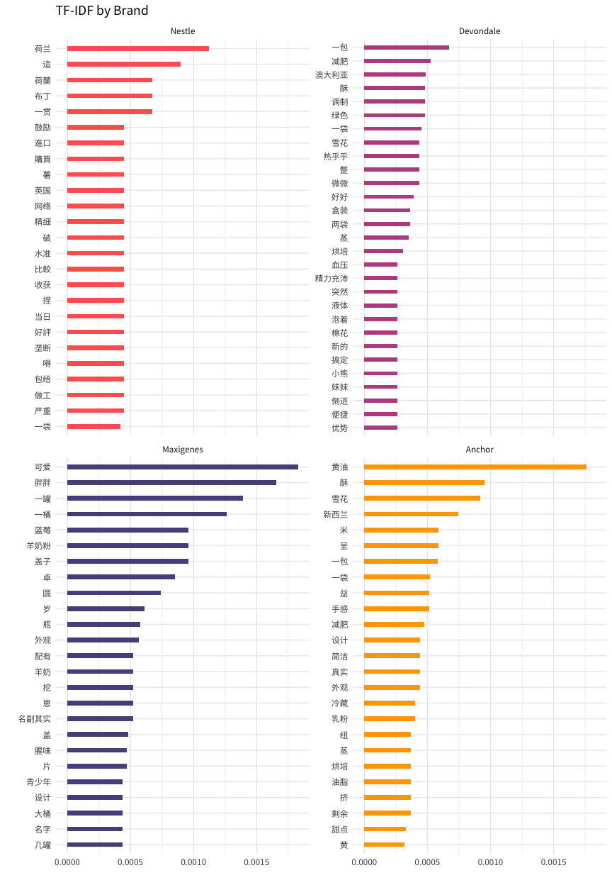
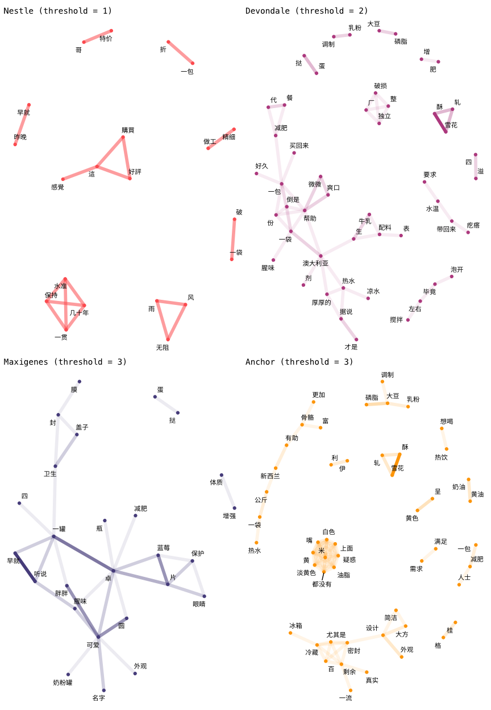

README
================

> This document is generated from README.Rmd. DO NOT edit
here.

#### 宗旨 Motivation

这是文本挖掘的一个示例，通过线上用户评论对某个物品或者垂直领域（多件物品组合）进行信息挖掘。主要突出了通过数据科学手段进行研究，在速度、拓展能力上的优势。示例将利用京东
(JD.com) 的用户评论，分别对4组进口成人奶粉品牌进行探索，了解各自品牌背后的声音。

4 组品牌分别是：雀巢 (**Nestle Nido**), 德运 (**Devondale**), 美可卓 (**Maxigenes**),
安佳 (**Anchor**) 。

我们在这里不会对代码进行诠释，源码可参考 [source](README.Rmd)。

#### 数据源 Data Source

数据源来自京东，具体地址请参考[附录](#product-url)。每组品牌收集了截止 2020-04-10 12:00 (*y-m-d
h:m*) 前最新的 500
条评论。在这里确保每一组的数据量统一是重要的。另外需要说明一点，每组品牌（成人奶粉）的物品都来自单一售卖链接，这里存在一定风险，京东可能利用不同的售卖链接针对不同的客户群（地理位置、用户画像等）进行不同的推广或者展示排名。这样一来，从单一的售卖链接解读某品牌或者物品不能概括所有的用户群体，有失公正。仅为了示例用途，我们在这里不会过于强调这点，但在现实场景中请务必确保数据的涵盖范围尽可能完善。

#### 词频 Term Count

文本挖掘通常的第一步都是把词拆解为 tokens，这里也不例外。`stringi` 内部使用了 ICU (International
Components for Unicode)
插件，可以直接对中文进行处理。举例：

``` r
stringi::stri_split_boundaries("我是一只小小小小鸟", type = "word", simplify = TRUE)
```

    ##      [,1]   [,2]   [,3]   [,4]   [,5]
    ## [1,] "我是" "一只" "小小" "小小" "鸟"

在这里，我们共有4 个品牌，每个品牌有 500 条评论，每条评论可分解为 𝓂 个 tokens，一个 token 简单代表一个词。在通过停用词表
(stopwords) 删除通用词后，我们汇集最常见的词汇，并对比这些词汇在所有品牌中的出现频率。

<!-- -->

这个模块探索的重点是对出现频率相差明显巨大的词汇进行关注，寻找线索。举例，针对“口感”“营养”“脱脂”这三个关键词，Anchor
的量比其他品牌都来得多。要记得各个品牌对比的基数是一致的（500
条评论），所以当某个品牌凸显某些关键词时，可能是条线索。当前所收集的词汇也让我们对整体成人奶粉领域有了初步的大画面。

另外一个有意思的现象，Nestle
的词频一致性的比其他品牌来的少，为什么？是奶粉本身的问题？还是像以上所说的，售卖链接的因素？基于这个问题延伸，我们看一看各个品牌评论用词长度的分布。

<!-- -->

很明显，Nestle 的分布与其他品牌不在同一个标准上。这意味着 Nestle
用户的评论一般都比较短，具体原因有待考证。至少我们有了新的意识，针对
Nestle 后续的分析得抱有质疑。

#### 网络 Network

这里指的网络是关系网络，而关系指的是词汇之间的关系。这个模块探索的重点是把之前收集的词汇拼接起来，加强我们对各个品牌的印象。节点 (node)
代表一个词，而节点与节点之间的连接 (link) 具有不同的链接强度。颜色的深浅代表同时出现的频率（越深越多）。

在这里我们不展开分析，通过简单的扫描，我们可以注意到以下几点，

1.  Nestle 的网络相对零散，用户评价良好但可以突出的重点不多；
2.  Devondale 和 Maxigenes 的网络非常相似。以【味道】为中心，并延伸出一个和【味道】紧连接的小群 (cluster)；
3.  Anchor
的网络以一个密度很高的小群为中心，小群包含了【营养】【味道】【香】【浓】【包装】的字眼；

<!-- --><!-- --><!-- --><!-- -->

#### TF-IDF

这个模块的重点在于如何通过现成的统计方法挑选出针对各个品牌的关键词汇，从而探索它们各自的特点。

TF-IDF 是一种文本挖掘的常用加权技术。主要思想是字词的重要性随着它在文本中出现的频率成正比增加，但同时会随着它在语料库中
(documents)
出现的频率成反比下降。举例，【味道】一词会出现许多次，可是它也会出现在每个品牌里，所以它的权重就会被降低。相反的，【减肥】一词也可能出现多次，可是只限于在某个品牌里，所以权重就会比【味道】来的高。这么一来，通过排除出现在每个品牌的普遍词汇，我们就可以得出针对各个品牌的关键词汇。

在这里可以具体关注以下几个关键词：

1.  【减肥】- 哪些品牌对节食群体具有吸引力？
2.  【雪花】【酥】【黄油】【调制】【烘焙】- 我们发现用户购买成人奶粉的用途之一是进行烘焙；
3.  【设计】【外观】- 用户如何评价外形包装？

如果你对 Maxigenes 的关键词【可爱】【胖胖】感到好奇，这是因为 Maxigenes
利用较为独特的罐子进行包装，并以“蓝胖子”一个绰号进行市场推广。

<!-- -->

同样的，我们可以通过网络把关键词之间的关联关系可视化展现出来。为了简化图表，这里用了节点数量作为下限 (threshold) 把部分词汇删除。

<!-- -->

#### 总结

这个示例展示了如何利用文本挖掘从用户反馈中进行信息提炼。我们首先利用词频对主题进行初步探索。接下来我们利用网络把词汇之间的关系串联起来。最后利用
TF-IDF 提取针对性的关键词。
假设你是一名商业分析师，利用这个框架可以快速的了解某个物品或者垂直领域，大大提升了在效率上的优势。

我们在这里只是蜻蜓点水，针对文本挖掘的技能还有许多，包括了实体识别、情感分析、主题提取等。这些技能在商业智能上也存在巨大的空间等着被发掘。举例，在这篇论文中，3
名来自 NYU
的作者利用文本挖掘[衡量产品特征的定价权](https://papers.ssrn.com/sol3/papers.cfm?abstract_id=1024903)。甚至有学者们[利用情感分析预判股票的走势](https://papers.ssrn.com/sol3/papers.cfm?abstract_id=3489226)。这就是数据科学的力量。

## Appendix

#### <a name="product-url"></a>Product URL

| Brand     | URL                                     |
| :-------- | :-------------------------------------- |
| Nestle    | <https://item.jd.com/5480615.html>      |
| Devondale | <https://item.jd.com/14817375522.html>  |
| Maxigenes | <https://item.jd.com/100004553486.html> |
| Anchor    | <https://item.jd.com/1805141.html>      |

#### Session Info

    ## R version 3.6.0 (2019-04-26)
    ## Platform: x86_64-apple-darwin15.6.0 (64-bit)
    ## Running under: macOS  10.15.4
    ## 
    ## Matrix products: default
    ## BLAS:   /Library/Frameworks/R.framework/Versions/3.6/Resources/lib/libRblas.0.dylib
    ## LAPACK: /Library/Frameworks/R.framework/Versions/3.6/Resources/lib/libRlapack.dylib
    ## 
    ## attached base packages:
    ## [1] stats     graphics  grDevices utils     datasets  methods   base     
    ## 
    ## other attached packages:
    ##  [1] patchwork_1.0.0     stringdist_0.9.5.2  ggraph_2.0.2.9000  
    ##  [4] igraph_1.2.4.2      widyr_0.1.3         text2vec_0.6       
    ##  [7] tidytext_0.2.3.9000 forcats_0.4.0       stringr_1.4.0      
    ## [10] dplyr_0.8.99.9002   purrr_0.3.3         readr_1.3.1        
    ## [13] tidyr_1.0.2         tibble_3.0.0        ggplot2_3.3.0.9000 
    ## [16] tidyverse_1.2.1    
    ## 
    ## loaded via a namespace (and not attached):
    ##  [1] viridis_0.5.1       httr_1.4.1          tidygraph_1.1.2    
    ##  [4] jsonlite_1.6        viridisLite_0.3.0   RhpcBLASctl_0.20-17
    ##  [7] modelr_0.1.4        assertthat_0.2.1    lgr_0.3.3          
    ## [10] highr_0.8           cellranger_1.1.0    yaml_2.2.0         
    ## [13] ggrepel_0.8.1       pillar_1.4.3        backports_1.1.6    
    ## [16] lattice_0.20-38     glue_1.4.0          digest_0.6.25      
    ## [19] polyclip_1.10-0     rvest_0.3.4         colorspace_1.4-1   
    ## [22] htmltools_0.3.6     Matrix_1.2-17       rsparse_0.3.3.4    
    ## [25] pkgconfig_2.0.3     broom_0.5.5         haven_2.1.0        
    ## [28] config_0.3          scales_1.1.0        tweenr_1.0.1       
    ## [31] ggforce_0.3.1       generics_0.0.2      farver_2.0.3       
    ## [34] ellipsis_0.3.0      withr_2.1.2         cli_2.0.2          
    ## [37] magrittr_1.5        crayon_1.3.4        readxl_1.3.1       
    ## [40] evaluate_0.14       stopwords_1.0       float_0.2-3        
    ## [43] tokenizers_0.2.1    janeaustenr_0.1.5   fansi_0.4.1        
    ## [46] nlme_3.1-139        SnowballC_0.7.0     MASS_7.3-51.4      
    ## [49] xml2_1.2.2          tools_3.6.0         data.table_1.12.2  
    ## [52] hms_0.5.0           lifecycle_0.2.0     munsell_0.5.0      
    ## [55] compiler_3.6.0      mlapi_0.1.0         rlang_0.4.5.9000   
    ## [58] grid_3.6.0          rstudioapi_0.11     labeling_0.3       
    ## [61] rmarkdown_1.15      gtable_0.3.0        graphlayouts_0.5.0 
    ## [64] R6_2.4.1            gridExtra_2.3       lubridate_1.7.4    
    ## [67] knitr_1.25          stringi_1.4.6       parallel_3.6.0     
    ## [70] Rcpp_1.0.4          vctrs_0.2.99.9011   tidyselect_1.0.0   
    ## [73] xfun_0.9
